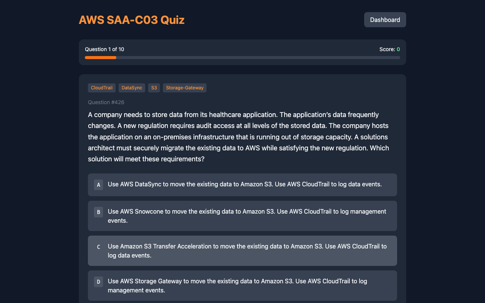
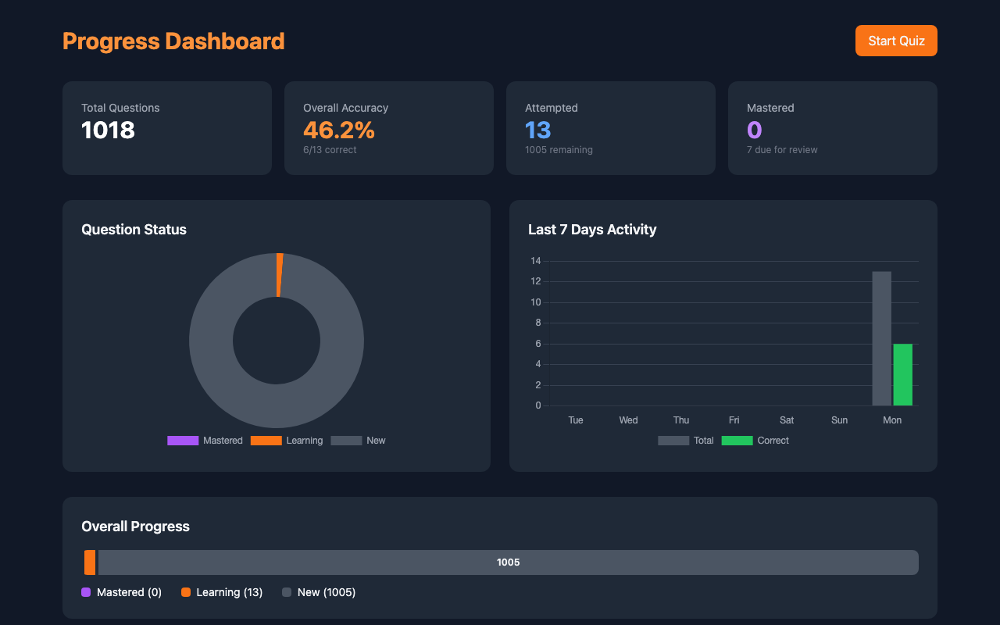

# AWS SAA-C03 Quiz Application

A self-hosted quiz application for AWS Solutions Architect Associate (SAA-C03) exam preparation with spaced repetition, progress tracking, and AWS service filtering.

## Features

- **1018 Practice Questions** - Comprehensive question bank covering all SAA-C03 exam domains
- **Spaced Repetition (SM-2)** - Intelligent review scheduling based on your performance
- **AWS Service Tagging** - Filter questions by 89 AWS services (EC2, S3, Lambda, etc.)
- **Progress Dashboard** - Track your performance with charts and statistics
- **Multiple Filter Modes**:
  - **All** - Practice from entire question bank
  - **New** - Focus on unseen questions
  - **Wrong** - Review previously incorrect answers
  - **Due** - Spaced repetition review queue
- **Configurable Sessions** - Choose 10, 20, 30, 50, or custom question counts
- **Keyboard Shortcuts** - Press A-D to select answers, Enter to submit/advance
- **Dark Mode UI** - Inter font, animated transitions, and toast notifications

## Quick Start (Docker)

```bash
# Clone the repository
git clone https://github.com/CarbonRaven/AWS-Quiz-SAA-C03.git
cd AWS-Quiz-SAA-C03

# (Optional) Set a secret key for persistent sessions across restarts
# If not set, a random key is generated on each startup
export SECRET_KEY=$(openssl rand -hex 32)

# Start the application
docker-compose up -d

# Access the quiz
open http://localhost:5050
```

## Quick Start (Local)

```bash
# Clone the repository
git clone https://github.com/CarbonRaven/AWS-Quiz-SAA-C03.git
cd AWS-Quiz-SAA-C03

# Create virtual environment
python3 -m venv venv
source venv/bin/activate  # On Windows: venv\Scripts\activate

# Install dependencies
cd aws-quiz
pip install -r requirements.txt

# Import questions and start
python import_questions.py
python app.py
```

Access the quiz at `http://localhost:5050`

## Screenshots

### Quiz Setup
Select question count, filter mode, and AWS service tags to customize your study session.


### Quiz Interface
Answer questions with immediate feedback showing correct answers.



### Progress Dashboard
Track your overall progress, accuracy rates, and review schedule.



## Project Structure

```
AWS-Quiz-SAA-C03/
├── aws-quiz/                    # Application code
│   ├── app.py                   # Flask web server
│   ├── models.py                # Database models & SM-2 algorithm
│   ├── import_questions.py      # JSON to SQLite importer
│   ├── requirements.txt         # Python dependencies
│   ├── Dockerfile              # Container configuration
│   ├── templates/              # HTML templates
│   │   ├── index.html          # Quiz interface
│   │   └── dashboard.html      # Progress dashboard
│   └── data/                   # SQLite database (created at runtime)
├── questions/                  # Question bank (1018 JSON files)
├── screenshots/                # Application screenshots
├── docker-compose.yml          # Docker orchestration
├── .dockerignore              # Docker build exclusions
└── README.md
```

## Question Format

Questions are stored as JSON files with the following structure:

```json
{
  "question_number": 1,
  "topic": 1,
  "question_text": "A company collects data for temperature...",
  "options": {
    "A": "Turn on S3 Transfer Acceleration...",
    "B": "Upload the data from each site...",
    "C": "Schedule AWS Snowball Edge...",
    "D": "Upload the data from each site to EC2..."
  },
  "correct_answer": "A",
  "community_vote": {
    "A": "94%"
  }
}
```

## Adding Custom Questions

1. Create a JSON file in `questions/` following the format above
2. Rebuild the Docker container or re-run the import:

```bash
# Docker
docker-compose build --no-cache && docker-compose up -d

# Local
python import_questions.py
```

## Spaced Repetition Algorithm

The application uses the SM-2 algorithm to optimize review scheduling:

- **Correct answers** increase the interval between reviews
- **Incorrect answers** reset the question to immediate review
- **Ease factor** adjusts based on performance history
- Questions are tagged as "due" when their next review date arrives

## AWS Services Covered

The question bank covers 89 AWS services including:

| Category | Services |
|----------|----------|
| Compute | EC2, Lambda, ECS, EKS, Fargate, Batch |
| Storage | S3, EBS, EFS, FSx, Storage Gateway |
| Database | RDS, Aurora, DynamoDB, ElastiCache, Redshift |
| Networking | VPC, CloudFront, Route 53, API Gateway, Direct Connect |
| Security | IAM, KMS, Cognito, WAF, Shield, GuardDuty |
| Analytics | Athena, Kinesis, EMR, Glue, QuickSight |
| Integration | SQS, SNS, EventBridge, Step Functions |

## Docker Commands

```bash
# Start in background
docker-compose up -d

# View logs
docker-compose logs -f

# Stop
docker-compose down

# Rebuild after changes
docker-compose build --no-cache && docker-compose up -d

# Reset progress (delete volume)
docker-compose down -v
```

## Configuration

### Secret Key
Flask uses `SECRET_KEY` to cryptographically sign session cookies, which store your in-progress quiz state (current question, score, answers). Without a persistent key, sessions are invalidated whenever the app restarts — you'd need to start a new quiz session. Your quiz history and spaced repetition progress are stored in the SQLite database and are **not** affected.

For a personal study app, leaving it unset is fine. To persist sessions across restarts, set it using any of these methods:

**Option 1: Environment variable**
```bash
export SECRET_KEY=$(openssl rand -hex 32)
docker-compose up -d
```

**Option 2: `.env` file** (automatically read by Docker Compose)
```bash
echo "SECRET_KEY=$(openssl rand -hex 32)" > .env
docker-compose up -d
```

**Option 3: Hardcode in `docker-compose.yml`**
```yaml
environment:
  - SECRET_KEY=your-secret-key-here
```

### Port
Default port is `5050`. To change, edit `docker-compose.yml`:

```yaml
ports:
  - "8080:5050"  # Access on port 8080
```

### Data Persistence
Quiz progress is stored in a Docker volume (`quiz-data`). To backup:

```bash
docker cp questions-aws-quiz-1:/app/data/quiz.db ./backup-quiz.db
```

## Tech Stack

- **Backend**: Python 3.12, Flask
- **Database**: SQLite
- **Frontend**: Alpine.js, Tailwind CSS, Chart.js, Inter (Google Fonts)
- **Server**: Gunicorn (production), Flask dev server (local)
- **Container**: Docker, Docker Compose

## Contributing

Contributions are welcome! Please feel free to submit pull requests for:

- Additional practice questions
- Bug fixes
- Feature enhancements
- Documentation improvements

## License

MIT License - See [LICENSE](LICENSE) for details.

## Disclaimer

This is an unofficial study tool. Questions are sourced from publicly available practice materials. AWS and the AWS logo are trademarks of Amazon.com, Inc. This project is not affiliated with or endorsed by Amazon Web Services.

## Acknowledgments

- Question content sourced from community practice exams
- SM-2 spaced repetition algorithm by Piotr Wozniak
- Built with Claude Code assistance
